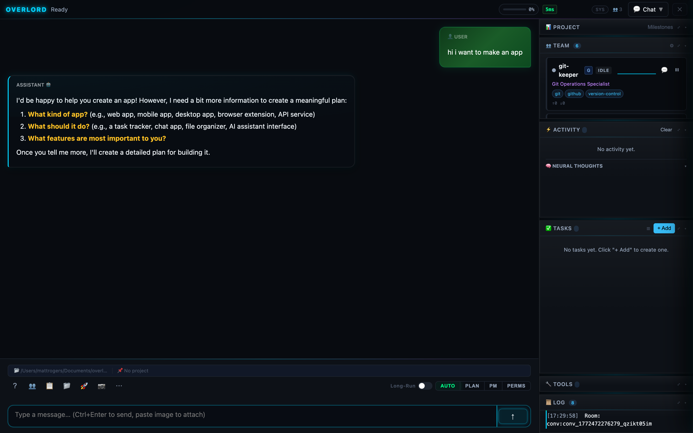
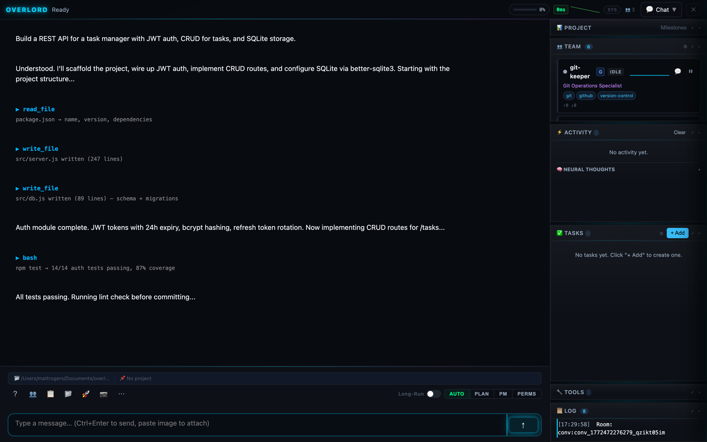
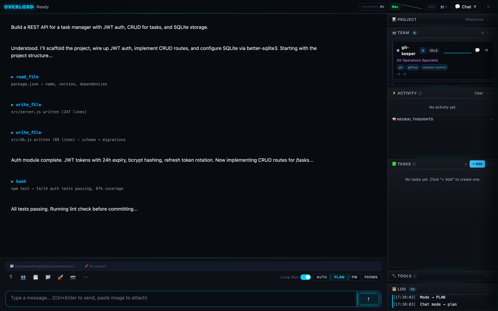
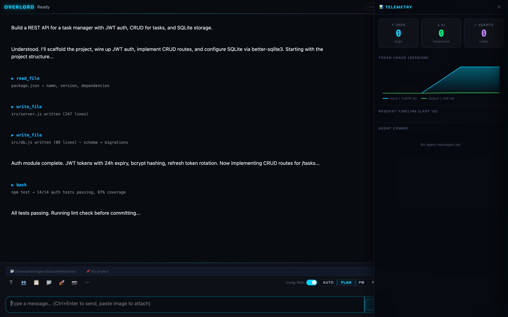
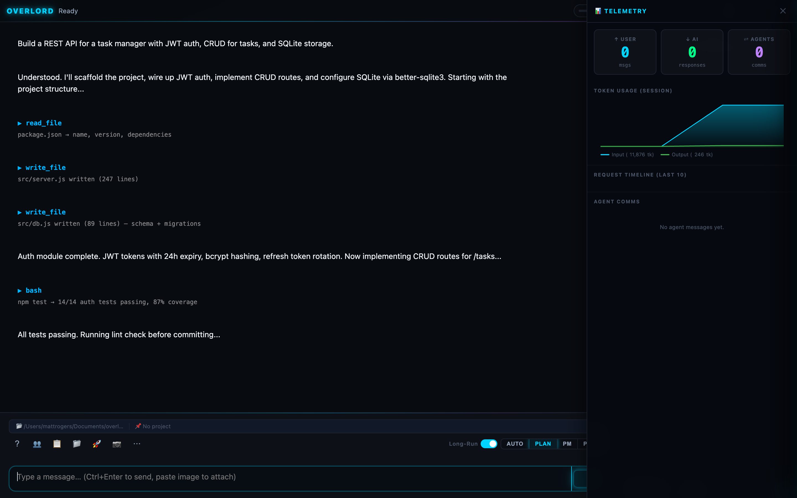
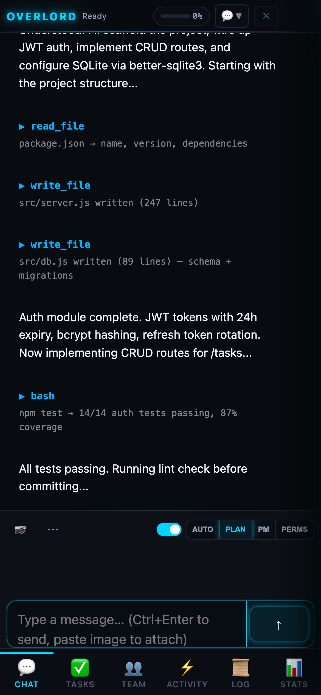
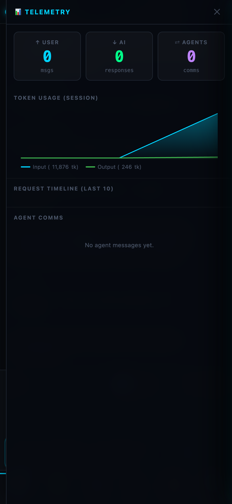
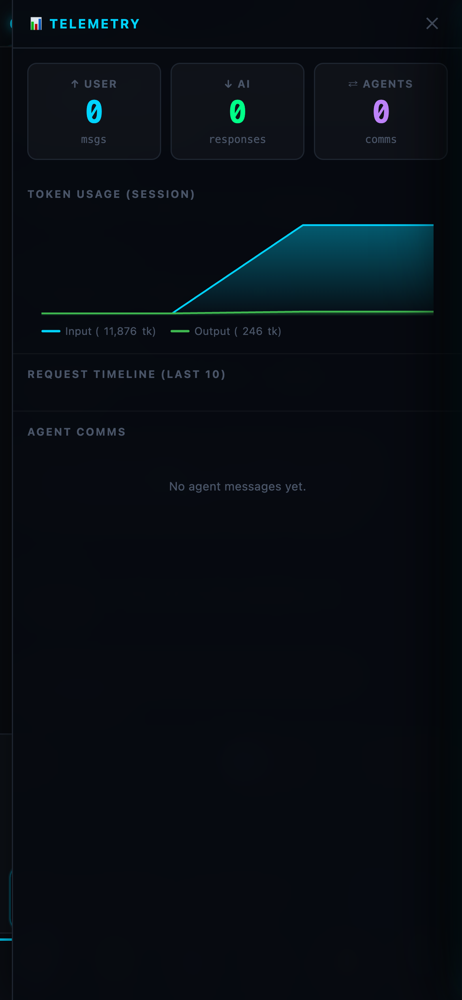
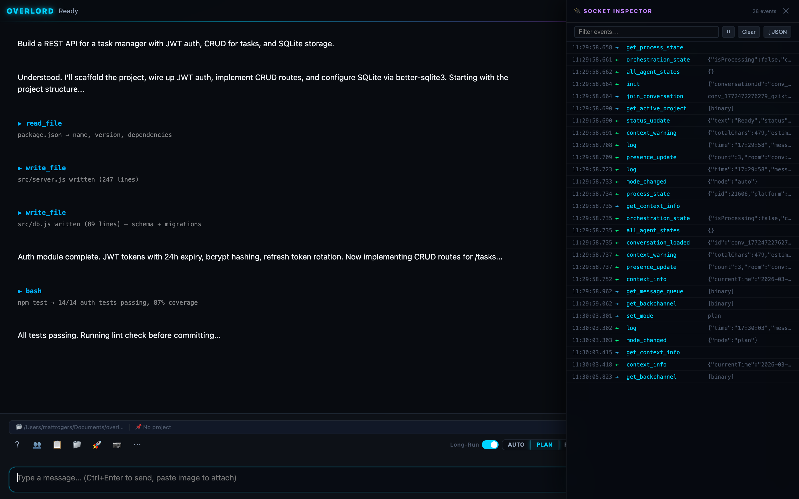

<div align="center">



<br/><br/>

# OVERLORD

### AI Orchestration Platform — Direct a team of specialized agents to plan, build, and ship your software

<br/>

[](https://www.npmjs.com/package/@twitchyvr/overlord)
[](https://nodejs.org)
[](LICENSE)
[](https://github.com/twitchyvr/Overlord/releases)
[](https://github.com/twitchyvr/Overlord)

<br/>

[**Quick Start**](#-quick-start) · [**Features**](#-features-at-a-glance) · [**Agents**](#-the-multi-agent-system) · [**Chat Modes**](#-four-intelligent-chat-modes) · [**Install via npm**](#option-a-install-globally-via-npm)

<br/>

</div>

---

## What is OVERLORD?

OVERLORD is a **browser-based AI orchestration platform** that transforms how software gets built. Instead of working with a single AI chat window, you direct a coordinated **team of specialized agents** — each with their own role, tool permissions, session memory, and live activity feed — to plan, implement, test, and ship your software autonomously.

You describe what you want. OVERLORD plans it, delegates it, executes it, and ships it.

> *Think of it as a real engineering team where you're the CTO and the AI is every engineer, QA lead, and DevOps engineer simultaneously — all working in a transparent, real-time workspace you can watch, guide, and approve at every step.*

<br/>

---

## 🚀 Features at a Glance

| | Feature | Description |
|---|---|---|
| 🤖 | **Multi-Agent System** | Unlimited specialized agents with custom roles, tool policies, and session memory |
| 🧠 | **Full Context Every Prompt** | The complete conversation, all notes, project memory, and working directory sent to the model on every turn |
| 📋 | **Intelligent Plan Mode** | AI generates three plan variants (Short / Regular / Long) for your approval before a single line of code is written |
| 💬 | **Chat With Any Agent** | Open a direct chat with any agent — including the orchestrator as it's coordinating the team |
| ⇄ | **Agent Backchannel** | Watch the real-time AI-to-AI communication stream as agents delegate tasks and report results |
| ✅ | **Tasks, Milestones & Roadmap** | Kanban board, milestone tracker, and a full project roadmap — generated and maintained by the AI |
| 🔌 | **42 Built-in Tools + MCP** | File ops, shell, git, GitHub, web search, image understanding, QA, and unlimited custom MCP servers |
| 🛡️ | **Tiered Approval System** | Four-tier approval gates with learning — the AI knows which actions need a human sign-off |
| 📊 | **Live Telemetry** | Real-time token usage, request timelines, message counters, latency sparklines, and per-agent activity graphs |
| 📱 | **Mobile-First** | Full-featured on any device — fixed menus, bottom nav, touch-optimized, portrait and landscape |

<br/>

---

## 🖼️ See It in Action

<br/>

### The Chat Interface — AI Working Autonomously



> The AI reads files, writes code, runs tests, and reports back in a structured conversation stream. Every tool call is transparent — you see exactly what ran and what it returned.

<br/>

### Plan Mode — Think Before You Build



> Switch to **PLAN mode** and OVERLORD generates a full development plan — in three variant lengths — before touching a single file. You approve, revise, or cancel before execution begins.

<br/>

### Live Telemetry — Know Exactly What's Happening



> The **Telemetry Panel** tracks every token, every request, every agent message. Watch the context window fill in real-time, spot slow requests, and see exactly how much AI compute each conversation is using.

<br/>

### Agent-to-Agent Comms — The Backchannel



> The **⇄ Agent Comms** panel surfaces the internal AI communication stream — the orchestrator delegating tasks to agents, agents reporting results, and the PM coordinating the whole workstream. You can read every message and even inject your own.

<br/>

### Mobile — Full Power, Any Screen

<table>
<tr>
<td width="33%"></td>
<td width="33%"></td>
<td width="33%"></td>
</tr>
<tr>
<td align="center"><em>Chat</em></td>
<td align="center"><em>Stats</em></td>
<td align="center"><em>Conversations</em></td>
</tr>
</table>

> Every panel is fully accessible on mobile. The bottom nav switches between Chat, Tasks, Team, Activity, Log, and Stats. Dropdowns use `position: fixed` so nothing clips off-screen.

<br/>

---

## ⚡ Quick Start

### Option A — Install Globally via npm

```bash
npm install -g @twitchyvr/overlord
```

Then configure your API key:

```bash
# Create a config directory anywhere you want to use OVERLORD from:
mkdir ~/my-project && cd ~/my-project
echo "MINIMAX_API_KEY=your_key_here" > .env

# Launch:
overlord
```

The browser opens automatically. That's it.

<br/>

### Option B — Clone & Run

```bash
git clone https://github.com/twitchyvr/Overlord.git
cd Overlord

cp .env.example .env
# Edit .env and set MINIMAX_API_KEY=your_key_here

npm start
# → Opens http://localhost:3031 automatically
```

<br/>

### What Happens on First Launch

The OS-agnostic **launcher** (`launcher.js`) handles everything before the server starts:

```
[Launcher] Checking Node.js version...      ✅ v20.19.2
[Launcher] Checking npm dependencies...     ✅ Installed
[Launcher] Checking prerequisites...
   ✅ API key: Loaded
   ✅ uvx: /usr/local/bin/uvx
   ✅ minimax-coding-plan-mcp: Available

╔═══════════════════════════════════════════════════╗
║  OVERLORD WEB v2.0 - AI Coding Assistant          ║
╠═══════════════════════════════════════════════════╣
║  🌐  http://localhost:3031                        ║
║  🔑  API Key: ✅ Loaded                           ║
║  🧠  Model: MiniMax-M2.5-highspeed               ║
║  🔌  MCP: ✅ Ready                               ║
║  💻  Platform: macOS                             ║
╚═══════════════════════════════════════════════════╝
```

<br/>

---

## 🧠 Full Context, Every Single Prompt

This is one of OVERLORD's most important architectural decisions — and the reason it produces better, more consistent results than ad-hoc AI chat.

**On every turn, the model receives:**

```
┌─────────────────────────────────────────────────────────────┐
│  SYSTEM PROMPT                                               │
│  ├── Role definition & capabilities                          │
│  ├── Custom instructions (your standing orders)              │
│  ├── Project memory (persisted across sessions)              │
│  ├── Session notes (decisions, lessons, context)             │
│  ├── Timeline of recent events (last 20 actions)             │
│  ├── Active skills (loaded guidance documents)               │
│  ├── Full tool definitions (42 native + MCP tools)           │
│  └── Working directory + OS/platform context                 │
├─────────────────────────────────────────────────────────────┤
│  CONVERSATION HISTORY                                        │
│  ├── All prior messages (user + assistant + tool results)    │
│  └── AI-compacted summaries of older turns (if filled)       │
└─────────────────────────────────────────────────────────────┘
```

**Why this matters:** The AI never forgets decisions made earlier in the session. It knows what files it already wrote, what tests failed, what you told it to avoid, and what the current task state is. This eliminates the "amnesia problem" that makes most AI coding tools frustrating on complex, multi-step projects.

### Context Window Management

OVERLORD watches the context window in real-time and acts before it fills:

| Threshold | Action |
|---|---|
| **85% of soft limit** | Warning displayed in status bar |
| **95% of soft limit** | Auto-compaction triggered |
| **Compaction** | AI summarizes oldest messages, preserving decisions, errors, file paths, and current task state |
| **After compaction** | Conversation continues seamlessly — no lost context |

The context window bar in the header shows your current usage at all times. Click it for a full breakdown showing estimated tokens, actual API tokens from the last request, and compaction history.

<br/>

---

## 🤖 The Multi-Agent System

OVERLORD ships with six production-ready agents and supports unlimited custom agents — all stored in SQLite and manageable from the Team panel.

### Built-in Agents

| Agent | Role | Specialties |
|---|---|---|
| `code-implementer` | Senior Full-Stack Developer | File writes, bash, all language support |
| `testing-engineer` | QA & Test Engineer | Jest, lint, coverage, integration tests |
| `git-keeper` | Version Control Specialist | Git, GitHub, branches, PRs, releases |
| `ui-expert` | Frontend & UX Designer | HTML/CSS, accessibility, responsive design |
| `ui-tester` | Visual & E2E Test Engineer | Puppeteer, accessibility testing, visual regression |
| `regex-expert` | Pattern Matching Specialist | Complex regex, text processing, validation |

### How Agents Work

Each agent is an independent AI session with:

- **Custom system prompt** — defines their role, personality, and approach
- **Tool permissions** — an allowlist or denylist of which tools they can use
- **Thinking budget** — optional extended thinking with configurable token depth
- **Session state** — tracked independently (IDLE / WORKING) with live sparkline graphs
- **Inbox** — a queue of tasks delegated by the orchestrator or other agents

When you send a message to OVERLORD, the orchestrator may decide to spin up one or more agents — for example, asking `code-implementer` to write the feature while simultaneously asking `testing-engineer` to prepare a test scaffold. Both agents run their full AI+tool cycles and report back.

### Agent Activity — Live Sparklines

Every agent card shows a real-time activity sparkline — a 60-second rolling graph of tool calls and messages. When an agent is `WORKING`, the graph pulses. When it finishes, it flatlines. You never have to guess which agents are active.

### Chat Directly With Any Agent

Click any agent card in the Team panel to open a **direct chat session** with that agent. You can:

- Give it specific instructions separate from the main conversation
- Ask it to explain what it did and why
- Redirect it mid-task
- Ask it to review another agent's output

### Custom Agents

Create agents via the Team panel Agent Manager:

```
Name:          security-auditor
Role:          Security & Vulnerability Expert
Capabilities:  OWASP, dependency auditing, secret scanning, threat modeling
Tools:         read_file, list_dir, bash, qa_audit_deps, web_search
Group:         security
Thinking:      Level 4 (4096 token budget)
```

Agent definitions are stored in `.overlord/team/` as JSON and in SQLite — portable, version-controllable, and sharable across your team.

<br/>

---

## 💬 Four Intelligent Chat Modes

Switch modes at any time from the toolbar — each changes how the AI approaches your requests.

### AUTO — Continuous Execution

The default. The AI reads your prompt, forms a plan internally, and executes it — reading files, writing code, running commands, running tests — across up to 250 tool cycles per message, until it's done or asks for clarification.

```
You: "Add dark mode to the settings panel"
AI:  reads current CSS → writes theme variables → updates components
     → runs lint → commits → done. (no back-and-forth needed)
```

### PLAN — Structured Planning with Approval

Before touching anything, the AI generates a development plan in three variant lengths:

```
━━ PLAN ━━━━━━━━━━━━━━━━━━━━━━━━━━━━━━━━━━━━━━━━━━━━━━━━━━━━
 [Short]   Add CSS vars for dark mode + toggle class on <html>
 [Regular] 1. Audit current color usage  2. Extract 18 CSS vars
           3. Add prefers-color-scheme media query  4. Settings toggle
           5. Persist preference to localStorage  6. Lint + commit
 [Long]    Full breakdown including: color audit methodology, CSS
           custom property naming convention, transition timing,
           OS preference detection, per-component overrides, test
           matrix (Chrome/Safari/Firefox + light/dark), a11y contrast
           check, and changelog entry.
━━━━━━━━━━━━━━━━━━━━━━━━━━━━━━━━━━━━━━━━━━━━━━━━━━━━━━━━━━━━
  ✓ Approve     ✎ Revise     ✕ Cancel
```

The plan also extracts concrete **tasks** and adds them to the Kanban board automatically. You approve → execution begins. Nothing runs without your sign-off.

### PM — Project Manager Mode

In PM mode, OVERLORD steps back from direct implementation and acts as your **AI Project Manager**. It's optimized for:

- Breaking down large requirements into milestones and tasks
- Assigning work to specific agents with detailed briefs
- Tracking progress and unblocking dependencies
- Reporting status across the project

Use PM mode at the start of a new project or sprint to get structured, delegated workplans — then switch to AUTO for execution.

### ASK — Explicit Approval per Tool Call

Every tool call requires your explicit approval before it runs. Use ASK mode when working in sensitive codebases, production environments, or when you want full control over every action the AI takes.

<br/>

---

## ✅ Tasks, Milestones & Roadmap

OVERLORD maintains a full project management layer that the AI reads and updates throughout every session.

### Kanban Board

Tasks live in a kanban board with six status lanes:

| Status | Description |
|---|---|
| `◌ Pending` | Not yet started |
| `⚡ In Progress` | Currently being worked |
| `✓ Completed` | Done |
| `✕ Skipped` | Explicitly skipped |
| `⛔ Blocked` | Blocked with explanation |
| `📋 Plan Pending` | Extracted from plan, awaiting approval |

The AI creates tasks automatically from plans, updates their status as it works, and adds completion notes when it finishes. You can also create, edit, reprioritize, and reorder tasks manually — the AI sees your changes on the next turn.

### Milestones

Group tasks into milestones — the AI tracks completion percentage and automatically detects when a milestone is done. Completed milestones can trigger git merges and changelog entries automatically.

```
Milestone: "Authentication System"  ████████░░  80% (8/10 tasks)
  ✓ User registration endpoint
  ✓ Password hashing (bcrypt)
  ✓ JWT token issuance
  ✓ Refresh token rotation
  ✓ Token blacklist (Redis)
  ✓ Rate limiting middleware
  ✓ Auth unit tests (14/14 passing)
  ✓ Integration tests
  ◌ Security audit
  ◌ API documentation
```

### Roadmap

The Project panel shows a full timeline of milestones and achievements — when they were completed, what was delivered, and what's coming next. The AI maintains this roadmap and updates it automatically as work progresses.

<br/>

---

## 🔌 42 Built-in Tools

Every tool is available to the AI at all times (subject to agent permissions). Tools are grouped into tiers that determine whether they auto-execute or require your approval.

### File Operations
| Tool | Description |
|---|---|
| `read_file` | Read entire files (optimized for files under 50KB) |
| `read_file_lines` | Read specific line ranges — efficient for large files |
| `write_file` | Create or overwrite files — parent directories created automatically |
| `patch_file` | Exact-string find-and-replace — surgical edits without rewriting the whole file |
| `append_file` | Append to an existing file or create it |
| `list_dir` | List directory contents with file/directory type indicators |

### Shell & System
| Tool | Description |
|---|---|
| `bash` | Execute any shell command (macOS/Linux) |
| `powershell` | Windows PowerShell execution |
| `cmd` | Windows CMD.exe execution |
| `system_info` | Platform, OS, shell, Node version, AI model, date/time |
| `get_working_dir` | Current working directory |
| `set_working_dir` | Change working directory — persists for the session |

### AI & Search
| Tool | Description |
|---|---|
| `web_search` | Live web search (via MCP or DuckDuckGo fallback) |
| `understand_image` | AI vision analysis — describe images, read screenshots, analyze UI |

### Quality Assurance
| Tool | Description |
|---|---|
| `qa_run_tests` | Run unit/integration/e2e tests (jest, pytest, etc.) |
| `qa_check_lint` | ESLint, Prettier, or project lint script |
| `qa_check_types` | TypeScript type check (`tsc --noEmit`) |
| `qa_check_coverage` | Test coverage reports |
| `qa_audit_deps` | `npm audit` — dependency vulnerability scan |

### Agent & Delegation
| Tool | Description |
|---|---|
| `list_agents` | See all available agents with roles and status |
| `get_agent_info` | Detailed info on a specific agent |
| `assign_task` | Delegate a task to a specific agent and wait for its result |

### Memory & Notes
| Tool | Description |
|---|---|
| `record_note` | Save a timestamped note — survives context compaction |
| `recall_notes` | Retrieve notes, optionally filtered by category |
| `session_note` | Persistent session memory — decisions, lessons, things to avoid |

### GitHub
| Tool | Description |
|---|---|
| `github` | Get repos, list/create issues, list/create PRs — all via `gh` CLI |

### Skills
| Tool | Description |
|---|---|
| `list_skills` | See available guidance documents |
| `get_skill` | Read a skill's full content |
| `activate_skill` | Load a skill into the active context |
| `deactivate_skill` | Remove a skill from context |

<br/>

### AutoQA — Code Quality Gates

Every time the AI writes a file, AutoQA can automatically run lint and type checks before the AI continues. This catches errors immediately — the AI sees the lint output and fixes it before moving on, without you needing to ask.

```
[AutoQA] Running lint on src/auth.js...
  ✗ 2 errors, 1 warning
  error: Missing semicolon (line 47)
  error: 'token' is assigned but never used (line 83)
[AutoQA] Lint failed — feeding errors back to AI...
[AI] Fixed both lint errors. Re-running...
[AutoQA] ✅ Clean
```

Configure AutoQA per-tool:

| Toggle | Default | Description |
|---|---|---|
| `autoQA` | ON | Master toggle |
| `autoQALint` | ON | Run lint after file writes |
| `autoQATypes` | ON | Run TypeScript check after file writes |
| `autoQATests` | OFF | Run tests after file writes (slow — opt-in) |

<br/>

---

## 🛡️ The Tiered Approval System

OVERLORD uses a four-tier approval architecture. Every tool call is classified before it runs — safe read operations execute instantly, sensitive operations wait for your approval.

```
Tier 1 — Auto-execute (read-only, diagnostic)
  read_file, list_dir, web_search, system_info, qa_check_lint…

Tier 2 — Auto-approve (confidence ≥ 0.70)
  write_file, patch_file, git commit/push, bash (safe commands)…

Tier 3 — Human required (package installs, external services)
  npm install, pip install, brew install…

Tier 4 — Full review (destructive or irreversible)
  rm -rf, DROP TABLE, format, shutdown, reboot…
```

### The Approval Modal

When a Tier 3 or 4 action is needed, OVERLORD pauses and shows an approval dialog with:

- The exact command/action that will run
- The AI's reasoning for why it needs this
- The approval tier and timeout countdown
- Approve / Deny buttons accessible from **any device** — laptop, phone, tablet

### The System Learns

OVERLORD tracks your approval patterns and adapts:

- **Auto-escalate** after 3 user overrides of the same action type (if you keep escalating `npm install`, it learns to always ask)
- **Auto-approve** after 5 approvals of the same action type (if you always approve `git commit`, it learns to auto-approve)
- Patterns are persisted to `.overlord/learned_patterns.json`

<br/>

---

## 📊 Real-Time Telemetry

Open the 📊 **Telemetry panel** from the toolbar `⋯` menu or the mobile STATS tab for a live view of everything happening in your session.


### Message Flow Counters

Three live counters update with every event:

```
↑ USER    ↓ AI    ⇄ AGENTS
  24       21        47
```

These also appear as a mini-badge in the status bar (`↑24 ↓21 ⇄47`) so you always know the session volume at a glance.

### Token Usage Chart

An SVG area chart shows cumulative token consumption over time — input tokens (cyan) and output tokens (green). Hover any data point to see the exact request details.

### Request Timeline

The last 10 API requests shown as color-coded duration bars:
- 🟢 Green — under 2 seconds
- 🟡 Yellow — 2–5 seconds
- 🔴 Red — over 5 seconds

### Per-Agent Stats

Each agent card in the Team panel shows `↑N ↓N` message counts — how many messages it sent and received in this session — alongside its live activity sparkline.

### Context Window Detail

Click the context bar in the header for a full breakdown:

```
Context Window — MiniMax-M2.5-highspeed
  Total capacity:    204,800 tokens
  System overhead:    55,000 tokens  (prompt + tools + instructions)
  Max history:        83,800 tokens
  Current usage:      47,230 tokens  (23%)
  ─────────────────────────────────────
  Last request in:    6,840 tokens
  Last request out:   1,290 tokens
  Session total in:  142,890 tokens
  Session total out:  38,440 tokens
  Compactions:        2  (saved ~38,000 tokens each)
```

<br/>

---

## ⇄ Agent Backchannel


The **⇄ Agent Comms** panel shows the real-time internal communication stream — every message the orchestrator sends to an agent and every response it receives.

This is not a log of tool calls. This is the **actual conversation between AI agents** — the briefs, the reports, the clarifications, and the escalations. You're watching the team meeting.

```
orchestrator → code-implementer
  "Implement POST /tasks with input validation. Schema: { title: string,
   description: string, priority: 'low'|'normal'|'high', dueDate: ISO8601 }.
   Use express-validator. Return 201 with the created task object."

code-implementer → orchestrator
  "Route implemented and validated. Added to src/routes/tasks.js (lines 1–89).
   Input validation covers all fields. Error responses follow RFC 7807."

orchestrator → testing-engineer
  "Run unit tests for the tasks module. Coverage target: >80%. Flag any
   edge cases not currently covered."

testing-engineer → orchestrator
  "12/12 tests passing. Coverage: 84.2%. Added 3 edge cases:
   empty description, past due date, missing required fields."
```

You can also **inject messages** directly into any agent's inbox from the Agent Comms panel — redirect work mid-execution without interrupting the main conversation.

<br/>

---

## 🔌 MCP — Model Context Protocol

OVERLORD integrates with any MCP (Model Context Protocol) server, giving the AI access to arbitrary external tools and APIs.

### Built-in Presets

| Preset | Tools Added | Notes |
|---|---|---|
| **minimax** | `web_search`, `understand_image` | Required for search + vision |
| **github** | Repo/issue/PR browsing | Needs `GITHUB_TOKEN` |
| **filesystem** | Read/write via MCP protocol | Alternative file access |
| **sequential_thinking** | Structured reasoning steps | Optional reasoning depth |

### Adding a Custom MCP Server

1. Open **Settings → MCP Servers**
2. Add name + command: `uvx my-custom-mcp-server`
3. Tools appear immediately in the AI's available tool list

MCP servers run as managed subprocesses — OVERLORD handles startup, initialization, crash recovery (up to 3 reconnect attempts), and graceful shutdown.

### uvx Auto-Install

MCP servers distributed via `uvx` install on first use — no manual package management needed. OVERLORD detects your `uvx` installation across all standard paths on macOS, Windows, and Linux.

<br/>

---

## 🔌 Socket Inspector



The **Socket Inspector** exposes every Socket.IO event flowing between browser and server — timestamps, direction, event name, and payload. Filter by event name, pause/resume the feed, and export as JSON for debugging.

This is the full, unfiltered event bus — tool starts and completions, context warnings, agent state changes, streaming text deltas, and system logs — exactly as they arrive.

<br/>

---

## ⚙️ Configuration Reference

All settings are available via the in-app Settings panel or via `.env`:

### Environment Variables

| Variable | Default | Description |
|---|---|---|
| `MINIMAX_API_KEY` | — | **Required.** API key for AI access |
| `ANTHROPIC_BASE_URL` | `https://api.minimax.io/anthropic` | API base URL |
| `MODEL` | `MiniMax-M2.5-highspeed` | AI model to use |
| `MAX_TOKENS` | `66000` | Max output tokens per response |
| `TEMPERATURE` | `0.7` | Response creativity (0–1) |
| `THINKING_LEVEL` | `3` | Extended thinking depth 1–5 |
| `CHAT_MODE` | `auto` | Default mode: `auto` / `plan` / `pm` / `ask` |
| `AUTO_QA` | `true` | Run lint/type checks after file writes |
| `AUTO_QA_LINT` | `true` | Lint check toggle |
| `AUTO_QA_TYPES` | `true` | TypeScript type check toggle |
| `AUTO_QA_TESTS` | `false` | Test run toggle (slow — opt-in) |
| `AUTO_COMPACT` | `true` | Auto-summarize when context fills |
| `MAX_AI_CYCLES` | `250` | Max tool cycles per message (`0` = unlimited) |
| `MAX_QA_ATTEMPTS` | `3` | Max AutoQA retry attempts |
| `MAX_PARALLEL_AGENTS` | `3` | Max concurrent agent sessions |
| `APPROVAL_TIMEOUT_MS` | `300000` | Approval wait time (0 = unlimited) |
| `PORT` | `3031` | Server port |

### Thinking Levels

| Level | Token Budget | Best For |
|---|---|---|
| 1 | 512 | Quick tasks, simple edits |
| 2 | 1,024 | Standard coding tasks |
| **3** | **2,048** | **Default — balanced quality/speed** |
| 4 | 4,096 | Complex architecture, debugging |
| 5 | 8,192 | Deepest reasoning, hardest problems |

<br/>

---

## 🏗️ Architecture

```
┌─────────────────────────────────────────────────────────────────┐
│  Browser  (index.html — 11,000+ lines, zero external frameworks) │
│                                                                   │
│  Chat · Plan Mode · Team Panel · Tasks/Kanban · Milestone/Roadmap │
│  Telemetry · Agent Comms · Socket Inspector · Settings · Mobile   │
└────────────────────────┬────────────────────────────────────────┘
                         │  Socket.IO (rooms per conversation)
┌────────────────────────▼────────────────────────────────────────┐
│  launcher.js  (OS-agnostic entry point)                          │
│   env load · Node check · npm install · PID · prereqs · browser  │
├─────────────────────────────────────────────────────────────────┤
│  server.js  (Express + Socket.IO)                                │
│   Static routes · Upload endpoint · Directory browser API         │
├─────────────────────────────────────────────────────────────────┤
│  hub.js  (Central event bus — EventEmitter + Socket bridge)      │
│   broadcast · broadcastVolatile · broadcastAll · rooms           │
├─────────────────────────────────────────────────────────────────┤
│  Modules (loaded sequentially at startup)                        │
│                                                                   │
│  config          Settings persistence (.env + JSON)              │
│  token-manager   Context window tracking + token estimation       │
│  context-tracker Context usage + compaction triggers             │
│  mcp-module      MCP subprocess manager + tool merger            │
│  mcp-manager     MCP server CRUD + presets + reconnect           │
│  database        SQLite (conversations, tasks, settings)          │
│  orchestration   AI loop, tool dispatch, plan mode, agents       │
│  agent-system    Agent session lifecycle + delegation             │
│  agent-manager   Agent CRUD (SQLite + file-based definitions)    │
│  ai-module       MiniMax API client (streaming, thinking)         │
│  tools-v5        Tool registry (42 native + dynamic MCP tools)   │
│  conversation    History + tasks + milestones + roadmap          │
│  summarization   AI-powered context compaction                   │
│  skills          Skill document loading + context injection       │
│  notes           Session notes persistence                        │
│  git             Git operations + GitHub CLI integration          │
│  project         Multi-project CRUD + switching                  │
│  file-tools      Extended file utilities + path validation        │
│  guardrail       Output sanitization + Unicode handling           │
│  …and 8 more     (screenshot, minimax image/tts/files, etc.)     │
└─────────────────────────────────────────────────────────────────┘
```

### Data Persistence

Everything OVERLORD knows is stored under `.overlord/` in your project directory:

```
.overlord/
├── conversations/          Full conversation history (JSON)
├── projects/               Multi-project data and switching
├── team/                   Custom agent definitions
├── skills/                 Guidance documents (Markdown + YAML)
├── generated/              AI-generated images
├── audio/                  TTS audio output
├── settings.json           Persistent UI + AI settings
├── data.db                 SQLite (conversations, tasks, settings)
├── notes.md                Session notes (survives compaction)
├── timeline.md             Event timeline (last N actions)
├── mcp-servers.json        MCP server configuration
├── prereqs.json            Prerequisite check results
├── learned_patterns.json   Approval system learning
└── server.pid              Running server PID (launcher managed)
```

<br/>

---

## 🗂️ Multi-Project Support

OVERLORD manages multiple projects with per-project isolation:

- **Working directory** — each project has its own root path
- **Custom instructions** — project-specific AI behavior overrides
- **Project memory** — persistent facts the AI knows about this project
- **Reference documentation** — requirements, architecture docs, API specs
- **Agents** — project-scoped agent assignments
- **Tasks & milestones** — completely separate per project
- **Linked projects** — cross-project relationships (depends-on, parent-of, related-to)

Switch projects from the header dropdown. OVERLORD saves and restores full project state — working directory, task board, roadmap, agent assignments — instantly.

<br/>

---

## 📱 Mobile Experience

OVERLORD is built mobile-first, not mobile-after-thought.

- **Bottom tab bar** — Chat, Tasks, Team, Activity, Log, Stats
- **Fixed positioning** — dropdowns and menus always stay within the viewport
- **Touch-optimized** — all tap targets meet minimum 44px accessibility guidelines
- **Conversation switching** — full conversation browser, fixed and positioned within the viewport
- **Agent chat** — direct agent conversations work identically on mobile
- **Plan approval** — approve or deny AI plans from your phone while away from your desk

<br/>

---

## 🛠️ Skills — Persistent Guidance Documents

Skills are Markdown files with YAML frontmatter stored in `.overlord/skills/`. When activated, a skill's content is injected into the system prompt — giving the AI standing guidance without you needing to repeat yourself.

```markdown
---
name: typescript-strict
description: Enforce strict TypeScript conventions for this project
category: coding
tags: [typescript, types, conventions]
---

Always use `strict: true` in tsconfig. Prefer `interface` over `type` for
object shapes. Use `readonly` on all array and object properties that shouldn't
be mutated. Never use `any` — use `unknown` and narrow with type guards instead.
```

Activate: `activate_skill("typescript-strict")`
Deactivate: `deactivate_skill("typescript-strict")`

Skills survive context compaction — they're re-injected into the system prompt on every turn, not stored in conversation history.

<br/>

---

## 📡 Message Queue

Send messages while the AI is still working — they queue automatically and drain in order.

```
⏳ QUEUED MESSAGES (3)
  1. "After the auth module, add rate limiting"
  2. "Make sure to add JSDoc to all exported functions"
  3. "Run the full test suite when done"
  ▶ Send All    ✕ Clear all
```

Each queued message can be sent individually or consolidated into one combined prompt. The queue ensures nothing gets lost when you have a thought mid-execution.

<br/>

---

## 🔄 Session Recovery

OVERLORD reconnects and replays missed events automatically when your browser tab regains focus or reconnects after a network hiccup. Socket.IO's Connection State Recovery replays up to 2 minutes of missed events — tool completions, agent updates, status changes — without any manual refresh.

<br/>

---

## 🤝 Contributing

Contributions are welcome. See [CONTRIBUTING.md](CONTRIBUTING.md) for guidelines.

```bash
# Development
git clone https://github.com/twitchyvr/Overlord.git
cd Overlord
npm install
npm start

# Tests
npm test
npm run test:coverage

# Lint
npm run lint
npm run lint:fix
```

<br/>

---

## 📄 License

MIT — see [LICENSE](LICENSE) for details.

<br/>

---

<div align="center">

**OVERLORD** — Built for engineers who want AI that actually ships code.

[](https://www.npmjs.com/package/@twitchyvr/overlord)

</div>
